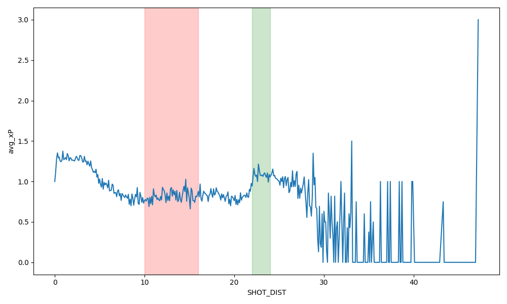
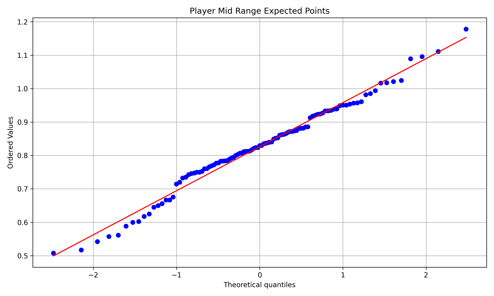
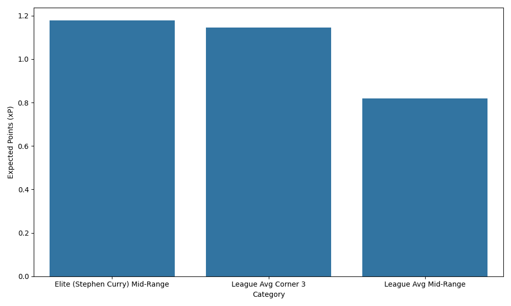

# DATA-375-Applied-Stats-Paper
This project investiages the 'Mid range Deadzone' in the NBA using shot logs from the 2014-2015 season. By calculating the Expected Points (xP) of each player based on shot distance, point type, shot result, and many other variables; this analysis determines if the mid range shot is statistically inefficient compared to corner threes. I also examine how elite players can become outliers and defy the statistical 'dip' in xP from mid range shots. 

This project utilizes several key skills such as Data Cleaning, Hypothesis Testing, QQ Plots, and Visualizations to observe my thesis. 

Some of my key findings were the mid range 'deadzone' (10-16 feet) has a statistically signficant lower xP than corner threes for the average player. I also found that elite shooters can produce a mid range xP that exceeds the league average not only in mid range, but corner three shots; suggesting an individuals skill can bridge geometric inefficiency. 

## Key Visualizations

### 1. The Mid-range Deadzone

### 2. Player Efficiency Distribution (Q-Q Plot)

### 3. Elite Outlier Comparison

